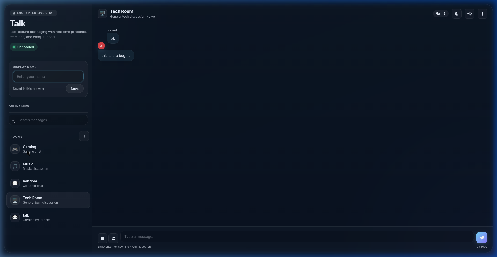

# Talk — Real-Time Multi-Room Chat

A fast, real-time group chat application with multi-room support, built with vanilla JavaScript and Firebase Realtime Database. No frameworks, no build step — just pure HTML, CSS, and JS.



## ✨ Features

### Multi-Room Chat
- **4 predefined rooms** — Tech Room 🖥️, Gaming 🎮, Music 🎵, Random 💬
- **Create custom rooms** — anyone can create a room with the "+" button
- **Instant switching** — rooms load instantly with isolated messages, presence, and typing indicators

### Messaging
- **Real-time sync** — messages appear instantly across all connected clients
- **Edit & delete** — edit or delete your own messages
- **Message reactions** — react to any message with 👍 ❤️ 😂 😮 😢 🔥
- **Image sharing** — upload images (max 500KB) or paste from clipboard
- **URL detection** — links are automatically converted to clickable anchors
- **Message grouping** — consecutive messages from the same user are visually grouped
- **XSS protection** — all content is escaped before rendering

### Presence & Typing
- **Online users** — see who's currently in the room with colored avatars
- **Typing indicators** — animated dots show when someone is typing
- **Auto-cleanup** — presence is removed on disconnect via Firebase `onDisconnect`

### UI & UX
- **Dark / Light theme** — toggle with one click, persisted in localStorage
- **Notification sounds** — synthesized via Web Audio API (no audio files needed)
- **Unread badge** — tab title updates with unread count when scrolled up
- **Emoji picker** — 120+ emojis in a searchable grid
- **Mobile responsive** — sidebar becomes a slide-out drawer on small screens
- **Keyboard shortcuts** — `Enter` to send, `Shift+Enter` for new line, `Ctrl+K` to search, `Esc` to close popups
- **Glassmorphism design** — modern dark-mode aesthetic with blur effects and gradients

## 🛠️ Tech Stack

| Layer | Technology |
|-------|-----------|
| Frontend | Vanilla HTML, CSS, JavaScript (ES Modules) |
| Backend | Firebase Realtime Database |
| Hosting | Firebase Hosting |
| CI/CD | GitHub Actions |
| Typography | Google Fonts (Inter) |
| Icons | Font Awesome 5 |

**Zero dependencies** — no `node_modules`, no bundler, no framework.

## 🚀 Getting Started

### Prerequisites
- A modern web browser
- [Firebase CLI](https://firebase.google.com/docs/cli) (optional, for deployment)

### Run Locally

1. **Clone the repository**
   ```bash
   git clone https://github.com/4mkbs/talk.git
   cd talk
   ```

2. **Open in browser**

   Simply open `index.html` in your browser, or use a local server:
   ```bash
   # Using VS Code Live Server extension
   # Or using Python
   python3 -m http.server 5500

   # Or using Node.js
   npx serve .
   ```

3. **Visit** `http://localhost:5500`

### Deploy to Firebase

```bash
npx -y firebase-tools@latest login
npx -y firebase-tools@latest deploy --only hosting
```

## 📁 Project Structure

```
talk/
├── index.html          ← Single-page app shell
├── app.js              ← All application logic (ES Module)
├── style.css           ← Complete design system with dark/light themes
├── screenshot.png      ← App screenshot
├── firebase.json       ← Firebase Hosting configuration
├── .firebaserc         ← Firebase project alias
├── .gitignore          ← Git ignore rules
└── .github/
    └── workflows/
        ├── firebase-hosting-merge.yml          ← Auto-deploy on push to main
        └── firebase-hosting-pull-request.yml   ← Preview deploy on PRs
```

## 🗄️ Database Schema

All data is stored in Firebase Realtime Database under room-scoped paths:

```
rooms/
  {roomId}/
    meta/               ← { name, icon, desc, predefined, createdBy, createdAt }
    messages/
      {messageId}/      ← { name, message, sentAt, edited, imageData, reactions }
    typing/
      {userId}/         ← { name, ts }
    presence/
      {userId}/         ← { name, ts }
```

## ⌨️ Keyboard Shortcuts

| Shortcut | Action |
|----------|--------|
| `Enter` | Send message |
| `Shift + Enter` | New line |
| `Ctrl + K` | Focus search |
| `Escape` | Close any popup |

## 📄 License

This project is open source and available under the [MIT License](LICENSE).
